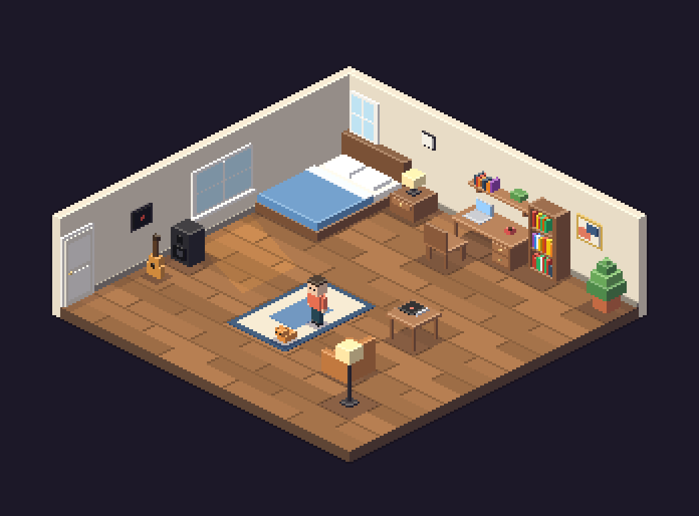
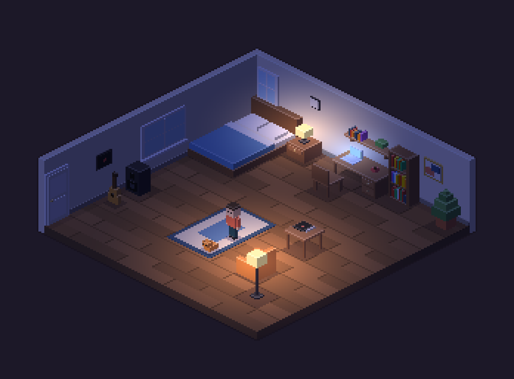

# DIMENSION33

Diseñá tu habitación en pixel-art isométrico y recorrela con tu personaje, **desde la PC o el celular**.
Sin instalaciones, sin cuentas y sin rastreo: todo corre en el navegador.

| Día | Noche |
|---|---|
|  |  |

## Qué se puede hacer

- **Construir**: 41 objetos (muebles, cocina, deco, música, alfombras y pared) con rotación, colores y apilado sobre mesas. Paredes lisas, a rayas, de ladrillo, con boiserie o azulejos.
- **Jugar**: caminá por la habitación, sentate, prendé lámparas, la tele o el tocadiscos (con música lo-fi generativa 🎶).
- **Día y noche** con iluminación dinámica.
- **Compartir**: la habitación completa viaja en el link (`#r=…`). Se guarda sola en tu navegador.
- **Instalable** como app (PWA) y funciona sin conexión.
- **Exportar** una imagen PNG para redes.

## Controles

| | PC | Celular |
|---|---|---|
| Colocar | Click | Tocar para previsualizar, tocar de nuevo o ✓ |
| Editar objeto | Click sobre el objeto | Tocar el objeto |
| Rotar / color | `R` / `C` | Botones de la barra |
| Cámara | Arrastrar · rueda · flechas | Arrastrar · pellizcar |
| Caminar | Click o `WASD`/flechas | Tocar el piso |
| Deshacer | `Ctrl+Z` | Botón ↶ |

Atajos completos en el menú **⋮ → Ayuda y controles**.

## Desarrollo

Requiere Node 20 o superior. No hay dependencias que instalar.

```sh
npm start        # http://localhost:5173
npm test         # tests unitarios
npm run check    # secretos + tests (antes de cada commit)
npm run smoke    # prueba en navegador real (necesita Playwright)
npm run hooks    # activa el hook que bloquea secretos en los commits
```

Estructura:

```
index.html            UI + CSP
src/engine/           rasterizador, proyección isométrica, colores (lógica pura)
src/game/             catálogo, reglas, escena, personaje, A* (lógica pura)
src/app.js            estado, acciones, cámara y bucle
src/main.js, src/ui/  DOM, entrada, audio, almacenamiento
tests/                tests unitarios (node:test)
tools/                escáner de secretos, íconos, capturas, prueba de humo
.claude/skills/       guías para Claude Code en este repo
```

## Publicar (GitHub Pages)

1. *Settings → Pages → Source: **GitHub Actions*** (una sola vez).
2. Cada push a `main` publica el juego en `https://<usuario>.github.io/DIMENSION33/`.

## Seguridad

Repo público con escaneo de secretos en cada commit y en CI, CSP estricta y validación de los links compartidos. Ver [SECURITY.md](SECURITY.md).
